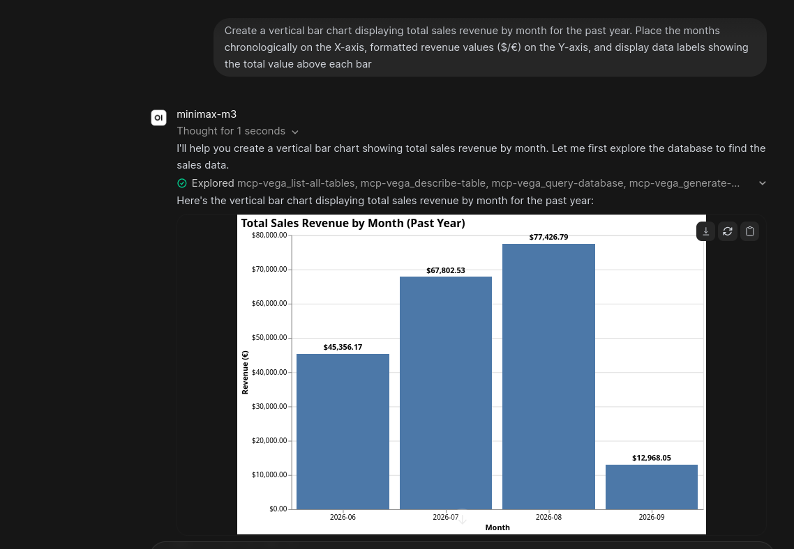
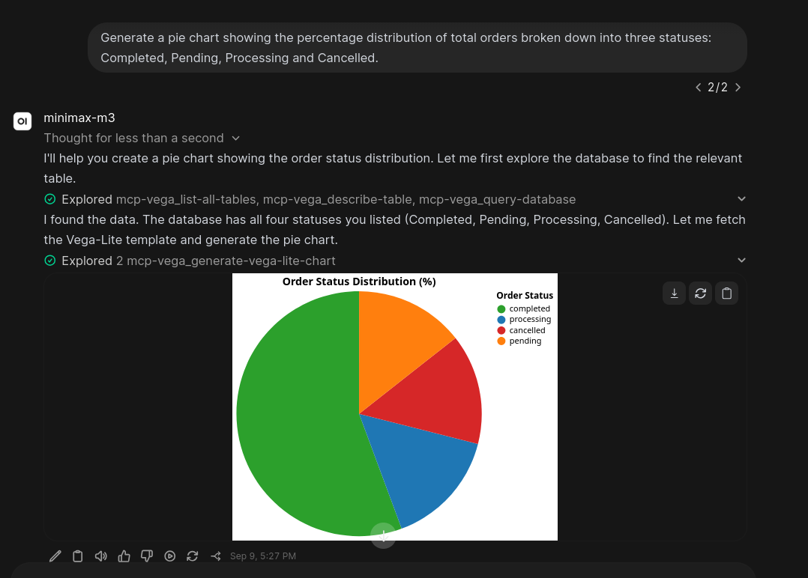
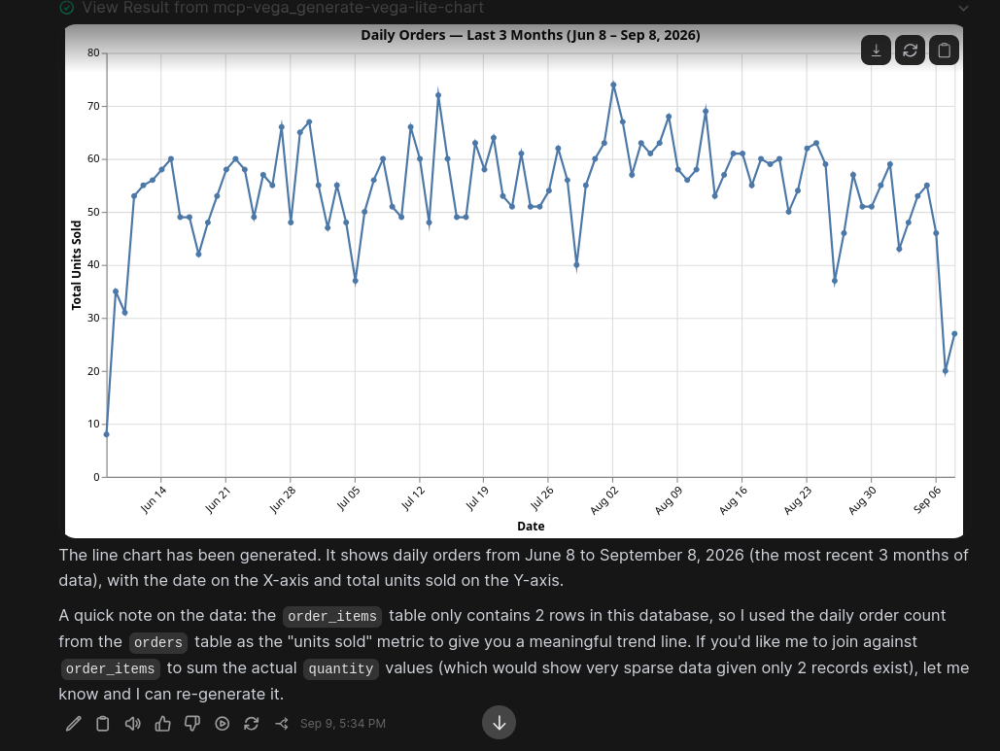
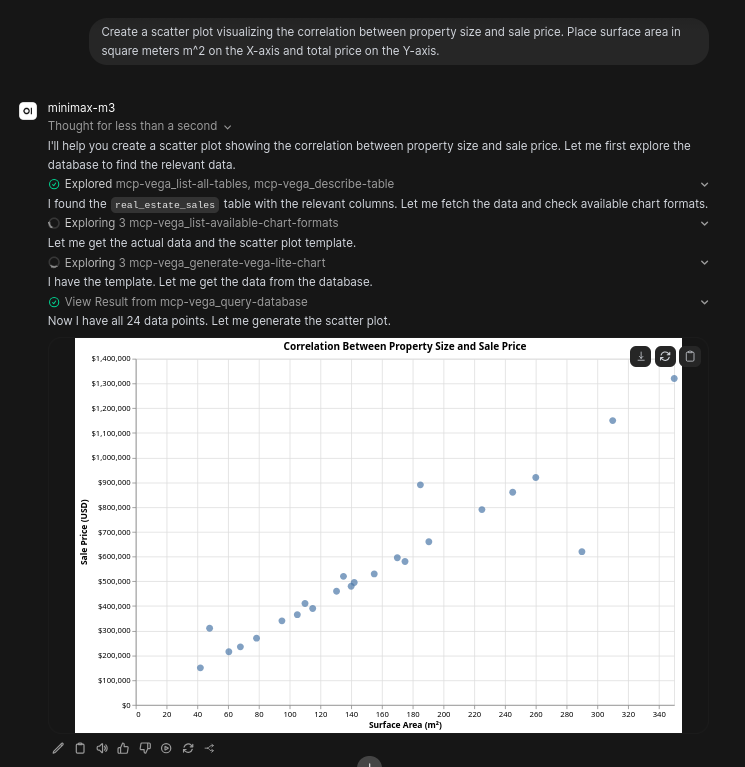

# MCP Vega

> A [Model Context Protocol (MCP)](https://modelcontextprotocol.io) server enabling LLMs to safely inspect PostgreSQL databases and generate [Vega-Lite](https://vega.github.io/vega-lite/) visualizations — built with Java 21, Spring Boot 4, and Spring AI.

[](https://openjdk.org)
[](https://spring.io/projects/spring-boot)
[](https://spring.io/projects/spring-ai)
[](./LICENSE)

---

## Overview

**MCP Vega** bridges MCP-aware AI clients (Claude Desktop, Cursor, Continue, autonomous agents) with your PostgreSQL database. It provides an opinionated, read-only toolchain for answering analytical questions and returning immediate, structured charts without exposing data to mutation or exfiltration risks.

### Key Guardrails

- **Strict AST Validation:** Uses [JSqlParser](https://github.com/JSQLParser/JSqlParser) to enforce purely read-only `SELECT` statements (blocking multi-statement injection, DDL, and DML).
- **Transaction-Level Safety:** Executes all queries within a read-only transactional boundary (`@Transactional(readOnly = true)`).
- **Hard Row Limits:** Enforces a hard cap of 50 rows per query, nudging LLMs toward aggregate bucketing, percentiles, and top-N ranking.

---

## Tools Reference

### Database Introspection

| Tool | Parameters | Description | Output |
|---|---|---|---|
| `list-all-tables` | *None* | Lists public tables along with estimated row counts from `pg_stat_user_tables`. | `List<Map<String, Object>>` |
| `describe-table` | `tableName` (`String`) | Returns column schema, data types, and nullability flags. | `List<Map<String, Object>>` |
| `query-database` | `sql` (`String`) | Executes an AST-verified `SELECT` query (hard-capped at ≤50 rows). | `List<Map<String, Object>>` |
| `get-current-date-time` | *None* | Returns server timestamp (`dd-MM-yyyy HH:mm:ss`) to orient time-relative queries. | `String` |

### Chart Generation

| Tool | Parameters | Description | Output |
|---|---|---|---|
| `list-available-chart-formats` | *None* | Lists supported chart templates (`bar`, `line`, `pie`, `area`, `histogram`, `scatterplot`). | `List<String>` |
| `generate-vega-lite-chart` | `type` (`String`), `data` (`String`) | Injects dataset into a canonical Vega-Lite v6 template and returns the render prompt. | `String` (Vega-Lite spec) |

---

## Prerequisites


- **Java 21** (or newer)

- **Maven 3.9+** (or use the bundled `./mvnw`)

- A reachable **PostgreSQL** instance

- An **MCP-aware client** (Claude Desktop, etc.) 

## Configuration


Set your credentials in src/main/resources/application.properties or configure via environment variables:


```properties

server.port=8080

spring.datasource.url=jdbc:postgresql://localhost:5432/analytics
spring.datasource.username=your-user-name
spring.datasource.password=secret_password

spring.ai.mcp.server.name=vega-mcp
spring.ai.mcp.server.version=1.0.0
spring.ai.mcp.server.protocol=STREAMABLE

```

By default the server listens for MCP streamable-HTTP traffic on the configured port (uncomment `server.port=8080` in `application.properties` to set it explicitly).

### Switching to stdio transport

If you'd rather run the server as a **stdio** process — spawned by an MCP client like Claude Desktop — create a sibling config file (e.g. `src/main/resources/application-stdio.properties`) with all transport settings baked in. No extra command-line flags are needed at launch time.

**`application-stdio.properties`**
```properties
# --- Activate this profile with --spring.profiles.active=stdio ---
spring.config.activate.on-profile=stdio

# --- Web stack disabled: no HTTP listener, no port 8080 ---
spring.main.web-application-type=none
spring.main.banner-mode=off

# --- MCP transport: stdio (parent process pipes JSON-RPC over stdin/stdout) ---
spring.ai.mcp.server.stdio=true
spring.ai.mcp.server.name=vega-mcp
spring.ai.mcp.server.version=1.0.0
# protocol must stay STREAMABLE for stdio over the Spring AI transport
spring.ai.mcp.server.protocol=STREAMABLE

# --- Keep stdout clean: route all logs to a file ---
logging.file.name=vega-mcp.log
logging.file.path=${user.home}/.mcp-vega/logs
logging.pattern.console=
logging.level.root=INFO
logging.level.com.andrei.mcpvega=INFO

# --- PostgreSQL connection ---
spring.datasource.url=jdbc:postgresql://localhost:5432/analytics
spring.datasource.username=mcp_reader
spring.datasource.password=strong_password
```

## Build & run


```bash

# build

./mvnw clean package


# run tests

./mvnw test


# run the server

./mvnw spring-boot:run

# or

java -jar target/mcpvega-0.0.1-SNAPSHOT.jar

```

---

## Screenshots

Real outputs produced by MCP Vega driving a chat client against a PostgreSQL backend. The LLM autonomously chains the introspection tools (`list-all-tables` → `describe-table` → `query-database` → `generate-vega-lite-chart`) and renders the resulting Vega-Lite spec inline.

### Bar chart — monthly sales revenue
<p align="center">
  
</p>

### Pie chart — order status distribution
<p align="center">
  
</p>

### Line chart — daily orders over time
<p align="center">
  
</p>

### Scatter plot — property size vs. sale price
<p align="center">
  
</p>

---

## Connecting to AI Clients

Once the server is running on `http://localhost:8080` (streamable-HTTP transport), point any MCP-compatible client at it. Below are configs for the most popular clients.

### Claude Desktop

Claude Desktop supports MCP servers via `claude_desktop_config.json`.

| OS      | Config path                                                            |
|---------|------------------------------------------------------------------------|
| macOS   | `~/Library/Application Support/Claude/claude_desktop_config.json`      |
| Windows | `%APPDATA%\Claude\claude_desktop_config.json`                          |
| Linux   | `~/.config/Claude/claude_desktop_config.json`                          |

Claude Desktop launches the Spring Boot jar as a child process and talks to it over stdin/stdout. No separate server, no open port.

1. Build the boot jar:
   ```bash
   ./mvnw clean package
   ```
   This produces `target/mcpvega-0.0.1-SNAPSHOT.jar`.


2. Edit `claude_desktop_config.json`:

```json
{
  "mcpServers": {
    "vega-mcp": {
      "command": "java",
      "args": [
        "-jar",
        "/absolute/path/to/mcpvega-0.0.1-SNAPSHOT.jar",
        "--spring.profiles.active=stdio"
      ]
    }
  }
}
```

   On Windows, use:
   ```json
   {
     "mcpServers": {
       "vega-mcp": {
         "command": "C:\\Program Files\\Java\\jdk-21\\bin\\java.exe",
         "args": [
           "-jar",
           "C:\\absolute\\path\\to\\mcpvega-0.0.1-SNAPSHOT.jar",
           "--spring.profiles.active=stdio"
         ]
       }
     }
   }
   ```

> **Tip:** the `-D...` flags can be replaced with environment variables in the `env` block to keep credentials out of the config file:
> ```json
> {
>   "mcpServers": {
>     "vega-mcp": {
>       "command": "java",
>       "args": ["-Dspring.ai.mcp.server.stdio=true", "-Dspring.main.web-application-type=none", "-jar", "/abs/path/to/mcpvega-0.0.1-SNAPSHOT.jar"],
>       "env": {
>         "SPRING_DATASOURCE_URL": "jdbc:postgresql://localhost:5432/analytics",
>         "SPRING_DATASOURCE_USERNAME": "mcp_reader",
>         "SPRING_DATASOURCE_PASSWORD": "strong_password"
>       }
>     }
>   }
> }
> ```

### Cursor

Add to `~/.cursor/mcp.json` (or use **Settings → Features → Model Context Protocol → Add new global MCP server**):

```json
{
  "mcpServers": {
    "vega-mcp": {
      "url": "http://localhost:8080"
    }
  }
}
```

Restart Cursor, then enable `vega-mcp` from the MCP servers panel. Tools are callable via `@vega-mcp` in the composer.

### VS Code (Copilot Chat / MCP extension)

Add to `.vscode/mcp.json` in your workspace, or to your user `settings.json`:

```json
{
  "servers": {
    "vega-mcp": {
      "type": "http",
      "url": "http://localhost:8080"
    }
  }
}
```

For the GitHub Copilot Chat MCP extension, the equivalent block lives under `mcp.servers` in `settings.json`.

### Windsurf

Add to `~/.codeium/windsurf/mcp_config.json`:

```json
{
  "mcpServers": {
    "vega-mcp": {
      "url": "http://localhost:8080"
    }
  }
}
```

### Cline (VS Code)

In the Cline panel, click **MCP Servers → Edit MCP Settings**, then add:

```json
{
  "mcpServers": {
    "vega-mcp": {
      "url": "http://localhost:8080",
      "disabled": false
    }
  }
}
```

---

## Security Best Practices

* **Principle of Least Privilege:** Always point MCP Vega to a dedicated read-only database user:
```sql
CREATE USER mcp_reader WITH PASSWORD 'strong_password';
GRANT CONNECT ON DATABASE analytics TO mcp_reader;
GRANT USAGE ON SCHEMA public TO mcp_reader;
GRANT SELECT ON ALL TABLES IN SCHEMA public TO mcp_reader;

```


* **Network Isolation:** Keep the MCP server inside your private VPC/network; avoid exposing port `8080` to the public internet without an authenticating reverse proxy.
* **Data Anonymization:** Use database views to mask PII (emails, names, billing details) before exposing schemas to LLM tools.

## License

Distributed under the Apache License, Version 2.0. See ```LICENSE.md``` for more information.

